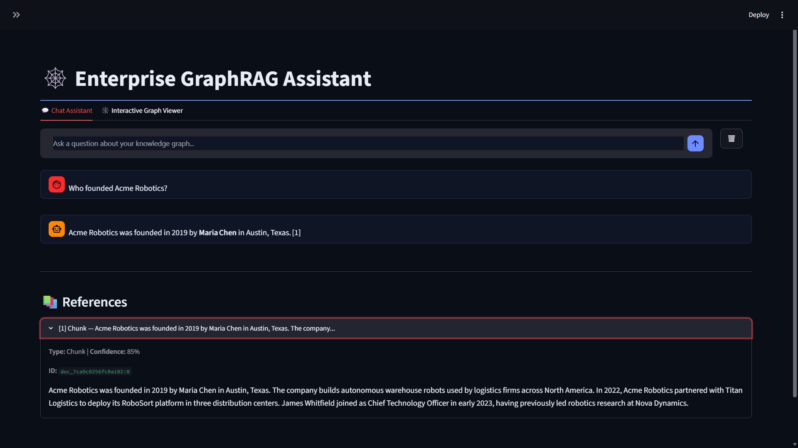
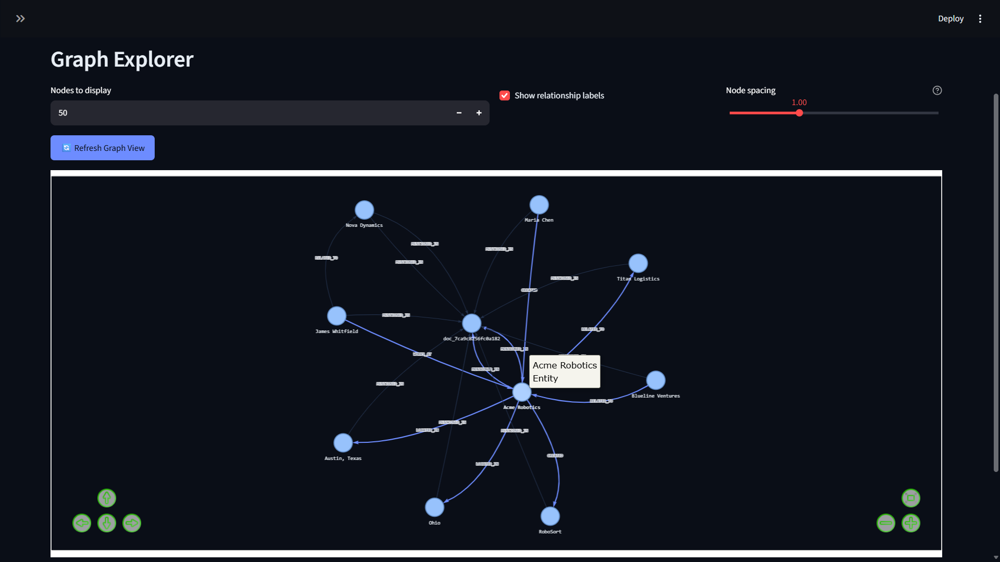

# Enterprise GraphRAG

A self-hosted, provider-agnostic knowledge graph pipeline that extracts entities and relationships from documents, validates every claim against source text before writing it to the graph, and answers questions with cited, grounded responses.

This is a portfolio project built to explore self-grounding RAG architecture end-to-end: document ingestion, LLM-based extraction, graph indexing, multi-provider LLM failover, and a chat interface with verifiable citations. It's a working local prototype — see [Scope & Limitations](#scope--limitations) below for what's in and out.

## What Makes This Different

Most RAG systems blindly trust LLM output. This one checks its work: every extracted entity and relationship is validated against the source document before being written to the graph. If a claim can't be verified word-for-word against the source, it's skipped — not silently, but with a friendly explanation shown to the user.

## Key Features

- 📄 Document ingestion with automatic semantic chunking
- 🕸️ Real-time knowledge graph construction (Neo4j)
- ✅ Self-grounding extraction — every claim verified against source text before writing
- 🔄 Provider-agnostic LLM layer with automatic failover (Anthropic, Groq, Cerebras, OpenAI-compatible)
- 💬 Chat interface with cited, grounded answers and expandable source references
- 🔍 Interactive graph visualization with hover tooltips
- 🗑️ One-click graph reset for testing multiple documents
- 🐳 One-click local deployment via Docker Compose

## Scope & Limitations

This is a working local prototype, not a production deployment:
- No authentication layer
- Tested single-user, not under concurrent load
- No staging/cloud deployment configured

These are natural next steps if this project were taken further.

## Quick start

**Requirements:** Docker Desktop (that's the only thing you need to install)

1. Clone this repo
2. Double-click `start.bat` (Windows) or run `docker compose up -d` (Mac/Linux)
3. Go to http://localhost:8501 (Streamlit UI will open automatically)
4. Go to the ⚙️ **LLM Settings** panel in the sidebar, pick a provider, and paste in a free API key (Groq's free tier is recommended — get one at https://console.groq.com)
5. Upload a PDF or text file and start asking questions

To stop everything cleanly, double-click `stop.bat` (Windows) or run `docker compose down` (Mac/Linux).

## Architecture

- **FastAPI** (`stages/fastapi_service/`) — HTTP API, orchestrates ingestion and query pipelines
- **Neo4j** — graph database storing entities, relationships, chunks, and document metadata
- **Streamlit** (`ui.py`) — web interface for document ingestion, chat, and graph visualization
- **Extraction** (`stages/extraction/`) — LLM-based entity/relation extraction with verbatim validation
- **Graph Indexing** (`stages/graph_indexing/`) — Neo4j writes, entity resolution, vector embeddings
- **Reasoning Agent** (`stages/reasoning_agent/`) — retrieval, ranking, and grounded response synthesis
- **LangChain/LangGraph** — LLM integrations and multi-step reasoning

## How extraction validation works

When a document is ingested:

1. **Chunking** — text is split into semantic chunks (LangChain RecursiveCharacterTextSplitter)
2. **Extraction** — the LLM identifies entities and relationships in each chunk
3. **Validation** — each extracted claim is checked:
   - Does the entity's surface_form appear verbatim in the chunk? (surface_form_check)
   - Does the relationship's evidence text appear verbatim? (evidence_check)
   - Do both source and target entities exist in this chunk? (relation_resolution)
4. **Graph writes** — only validated claims are written to Neo4j
5. **User feedback** — skipped claims are shown in the UI with friendly explanations (e.g., "🔍 A detail couldn't be double-checked")

This prevents hallucinations from polluting your knowledge graph.

## Notable bugs found and fixed along the way

**Neo4j silent-commit catastrophe** — The graph writer reported "SUCCESS" in logs but queries showed zero nodes in Neo4j. The culprit: `session.run()` closes the session immediately, leaving pending write transactions to fail after it exits. Discovered by querying Neo4j directly instead of trusting the logs. Fixed by using `write_transaction()`, which guarantees the transaction commits before returning. This means all the extraction work was happening correctly, but nothing was actually persisting.

**Stringified JSON from Claude's structured output** — Claude's API was returning entities as a JSON-encoded string (`"[{...}]"`) instead of a native list, silently breaking Pydantic validation. The model wasn't inventing data—it was being forced into the wrong format by a schema mismatch. Fixed by detecting the string wrapper at parse time and deserializing it before validation. This was only caught because extraction tests showed 0 entities despite the LLM producing output.

**Provider/API-key crossover in the fallback chain** — When Anthropic's structured-output call failed, the fallback to Groq was receiving Anthropic's API key instead of Groq's, causing 401 errors and silent extraction failures. The bug was in the exception handler—it was passing the wrong credentials to the fallback provider. Fixed by explicitly threading the correct key through the fallback chain per provider.

**Docker networking invisibility** — The Streamlit UI container was calling `http://localhost:8000/api/v1/ingest` instead of `http://fastapi:8000/api/v1/ingest`, causing every API request to fail silently with connection timeouts. No error in the UI, no error in the server logs—the request never reached the server. Fixed by using Docker Compose service names instead of localhost.

**Rate-limit detection gaps** — Groq wraps rate-limit errors as `400 BadRequest` with a specific message, not the standard HTTP 429. Rate-limit backoff was only checking for 429, so Groq rate-limits were treated as permanent failures instead of transient ones. Fixed by matching on error message content across providers, not just HTTP status codes.

All of these were invisible failures—logs said "success," the UI showed green checkmarks, and nothing was wrong until you checked the actual state of the system. That's why the pipeline has multiple defensive checks: validate against Neo4j directly, spot-check LLM output format, thread credentials explicitly, use service names in Docker, and match provider-specific error patterns.

## Configuration

Create a `.env` file in the project root with your API keys (see `.env.example`):

    ANTHROPIC_API_KEY=sk-ant-...
    GROQ_API_KEY=gsk-...
    CEREBRAS_API_KEY=csk-...
    NEO4J_PASSWORD=your-secure-password

The UI's LLM Settings panel allows per-request provider/key overrides without restarting.

## Development

- Python 3.11+
- `pip install -r requirements.txt`
- `docker compose up -d` to start Neo4j
- Edit `ui.py` for UI changes, `stages/*/` for pipeline logic

## Status

Actively developed. Working MVP with all core features. See GitHub Issues for planned improvements.