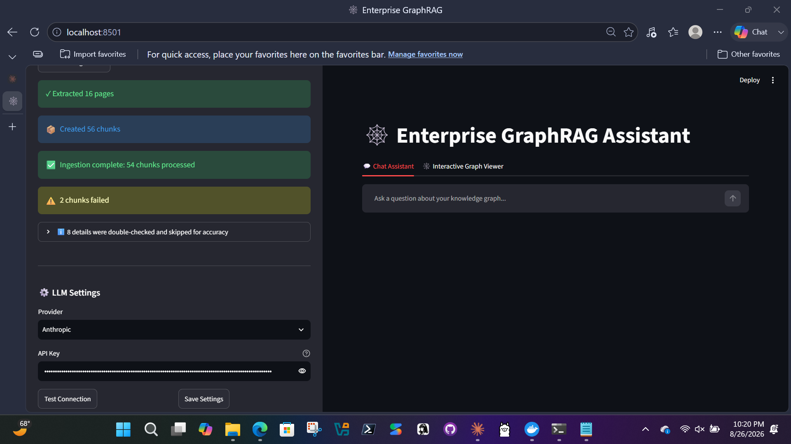
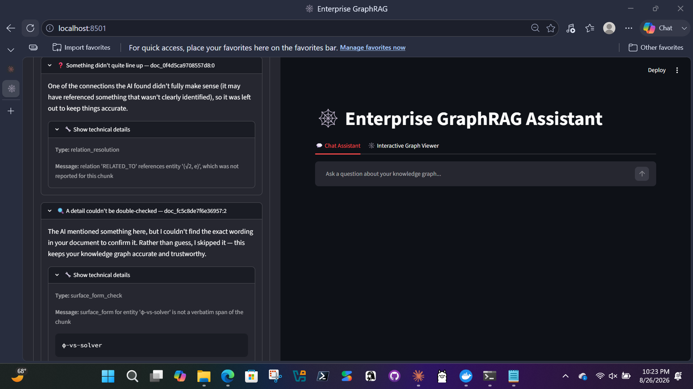
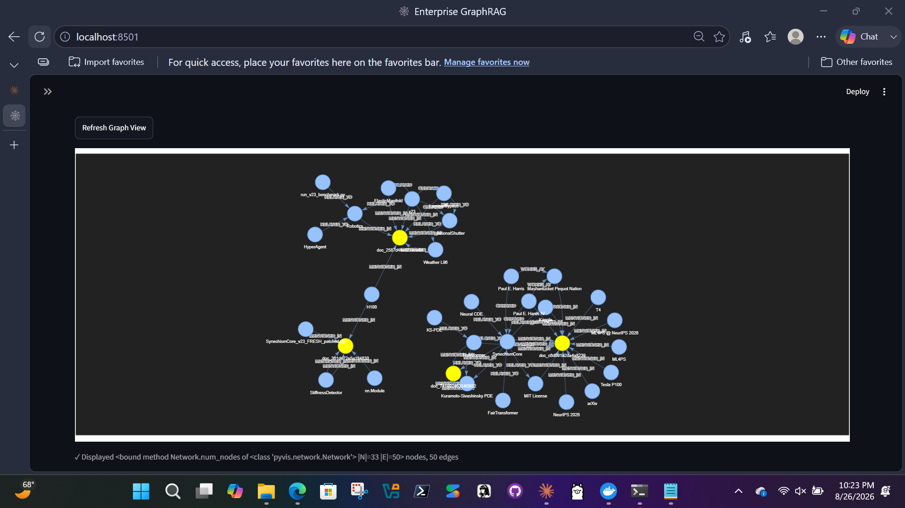

# Enterprise GraphRAG Assistant

A self-hosted, provider-agnostic knowledge graph pipeline that turns documents into a queryable graph — and refuses to write claims it can't verify against your source text.



## What makes this different

Most RAG tools trust the model's output blindly. This one checks its own work: every extracted entity and relationship is validated against the source document before being written to the graph. If the model can't point to the exact text backing up a claim, that claim is skipped — not silently, but with a plain-language explanation shown to you.

It also isn't locked to one AI provider. Groq, Cerebras, Anthropic, or any OpenAI-compatible endpoint — switch providers from the UI, per request, with no restart and no code changes.

## Features

- 📄 PDF/text ingestion with automatic chunking
- 🕸️ Real-time knowledge graph construction (Neo4j)
- 💬 Chat interface with cited, grounded answers
- 🔍 Interactive graph visualization
- 🔀 Provider-agnostic LLM layer with automatic failover
- ✅ Self-grounding extraction — validates claims against source text
- 🐳 One-click deployment via Docker Compose

## Quick start

**Requirements:** Docker Desktop (that's the only thing you need to install)

1. Clone this repo
2. Double-click `start.bat` (Windows) or run `docker compose up -d` (Mac/Linux)
3. Go to http://localhost:8501 (Streamlit UI will open automatically)
4. Go to the ⚙️ **LLM Settings** panel in the sidebar, pick a provider, and paste in a free API key (Groq's free tier is recommended — get one at https://console.groq.com)
5. Upload a PDF or text file and start asking questions

To stop everything cleanly, double-click `stop.bat` (Windows) or run `docker compose down` (Mac/Linux).

## Architecture

- **FastAPI** (`stages/fastapi_service/`) — HTTP API, orchestrates ingestion and query pipelines
- **Neo4j** — graph database storing entities, relationships, chunks, and document metadata
- **Streamlit** (`ui.py`) — web interface for document ingestion, chat, and graph visualization
- **Extraction** (`stages/extraction/`) — LLM-based entity/relation extraction with verbatim validation
- **Graph Indexing** (`stages/graph_indexing/`) — Neo4j writes, entity resolution, vector embeddings
- **Reasoning Agent** (`stages/reasoning_agent/`) — retrieval, ranking, and grounded response synthesis
- **LangChain/LangGraph** — LLM integrations and multi-step reasoning

## How extraction validation works

Every extracted claim is checked against the source document before being added to the graph. Here's what that means in practice:

When you upload a document, the system breaks it into chunks and asks the LLM to extract entities and relationships. But instead of blindly trusting the output, it verifies:

- **Entity check:** Does the entity's name actually appear in the text, word-for-word?
- **Relationship check:** Can we find the exact sentence that supports this relationship?
- **Both sides exist:** Are both the source and target entities mentioned in the same chunk?

If any check fails, the claim is **skipped** — not deleted, not fabricated, but marked as unverifiable. You see a friendly explanation in the UI telling you why:



This happens at extraction time, preventing hallucinations from ever reaching your graph. The result is a knowledge graph you can trust — every node and edge links back to actual text:



## Notable bugs found and fixed along the way

**Neo4j silent-commit catastrophe** — The graph writer reported "SUCCESS" in logs but queries showed zero nodes in Neo4j. The culprit: `session.run()` closes the session immediately, leaving pending write transactions to fail after it exits. Discovered by querying Neo4j directly instead of trusting the logs. Fixed by using `write_transaction()`, which guarantees the transaction commits before returning. This means all the extraction work was happening correctly, but nothing was actually persisting.

**Stringified JSON from Claude's structured output** — Claude's API was returning entities as a JSON-encoded string (`"[{...}]"`) instead of a native list, silently breaking Pydantic validation. The model wasn't inventing data—it was being forced into the wrong format by a schema mismatch. Fixed by adding a Pydantic `model_validator` with `mode="before"` that deserializes stringified fields before validation. This was only caught because extraction tests showed 0 entities despite the LLM producing output.

**Broken retry logic for stringified JSON** — When structured output validation failed on stringified fields, the fallback logic would retry by calling `invoke()` again—exactly the same call that just failed. The model hadn't changed, the schema hadn't changed, so the error repeated. Fixed by removing the broken retry and relying on the Pydantic validator (which works correctly) and the provider fallback chain (Anthropic → Groq) for real recovery.

**Anthropic+Groq model name crossover** — When setting up Anthropic with a Groq fallback, the Groq client was initialized with the Anthropic model name (`claude-haiku-4-5-20251001`), causing 404 errors from Groq's API. Groq doesn't recognize Claude model IDs. Fixed by explicitly mapping to a valid Groq model (`openai/gpt-oss-120b`) in the fallback initialization.

**Provider/API-key crossover in the fallback chain** — When Anthropic's structured-output call failed, the fallback to Groq was receiving Anthropic's API key instead of Groq's, causing 401 errors and silent extraction failures. The bug was in the exception handler—it was passing the wrong credentials to the fallback provider. Fixed by explicitly threading the correct key through the fallback chain per provider.

**Docker networking invisibility** — The Streamlit UI container was calling `http://localhost:8000/api/v1/ingest` instead of `http://fastapi:8000/api/v1/ingest`, causing every API request to fail silently with connection timeouts. No error in the UI, no error in the server logs—the request never reached the server. Fixed by using Docker Compose service names instead of localhost.

**Rate-limit detection gaps** — Groq wraps rate-limit errors as `400 BadRequest` with a specific message, not the standard HTTP 429. Rate-limit backoff was only checking for 429, so Groq rate-limits were treated as permanent failures instead of transient ones. Fixed by matching on error message content across providers, not just HTTP status codes.

All of these were invisible failures—logs said "success," the UI showed green checkmarks, and nothing was wrong until you checked the actual state of the system. That's why the pipeline has multiple defensive checks: validate against Neo4j directly, spot-check LLM output format, thread credentials explicitly, use service names in Docker, and match provider-specific error patterns.

## Configuration

Create a `.env` file in the project root with your API keys (see `.env.example`):

```
ANTHROPIC_API_KEY=sk-ant-...
GROQ_API_KEY=gsk-...
CEREBRAS_API_KEY=csk-...
NEO4J_PASSWORD=your-secure-password
```

The UI's LLM Settings panel allows per-request provider/key overrides without restarting.

## Development

- Python 3.11+
- `pip install -r requirements.txt`
- `docker compose up -d` to start Neo4j
- Edit `ui.py` for UI changes, `stages/*/` for pipeline logic

## Status

Actively developed. Working MVP with all core features. See GitHub Issues for planned improvements.
